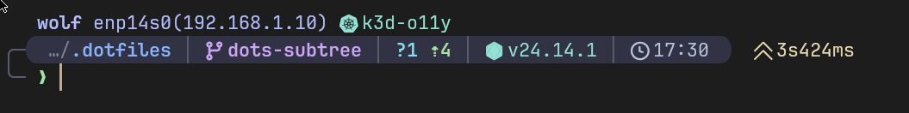

# Catppuccin Mocha Dark Starship config

A clean, readable [Starship](https://starship.rs/) prompt using the [Catppuccin Mocha](https://github.com/catppuccin/catppuccin) palette.



## Prerequisites

- [Starship](https://starship.rs/)
- [Nerd Font](https://www.nerdfonts.com/)
- True color terminal

## Install

```bash
curl -o ~/.config/starship.toml https://raw.githubusercontent.com/gipo355/starship-catpuccin-mocha-dark/main/starship.toml
```

## License

MIT
